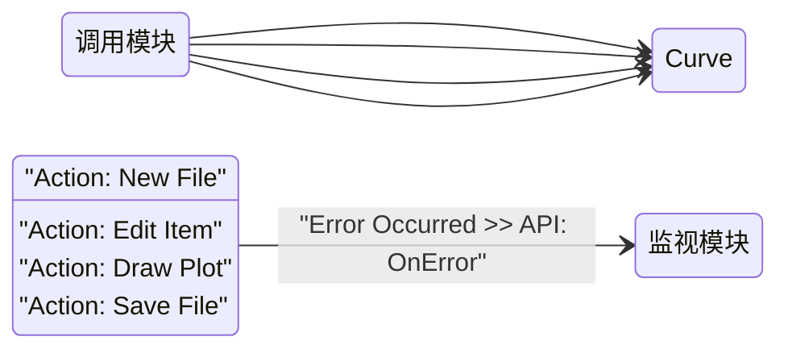

# `Curve Editor` — CSM 模块接口文档

> **使用说明**
>
> 1. 本文件基于 [CSM-Module-Repo-Template](https://github.com/NEVSTOP-LAB/CSM-Module-Repo-Template) 的 `module-template.md` 模板生成。
> 2. 模块运行时名称即 `Curve Editor`，与文件名对应。
> 3. 本模块属于 `Curve Editor.lvlib` 模块组。

---

## 功能简述

`Curve Editor` 是一个 CSM 模块，用于创建、编辑和可视化数学曲线（直线、抛物线、正弦波）。支持分组管理曲线项、文件持久化以及前面板交互。

该模块最初基于 QMH 架构开发，现已重构为 CSM 架构，保持原有功能的同时提升了模块的可通信性和可复用性。

---

## 模块信息

| 属性           | 值                                              |
| -------------- | ----------------------------------------------- |
| LabVIEW 版本   | ≥ 2020                                          |
| 支持的操作系统 | Windows                                         |
| 支持 RT        | ❌ 不支持                                       |
| 支持 64-bit    | ✅ 支持                                         |
| 所属模块组     | Curve Editor.lvlib                              |

---

## 依赖项

| 依赖                                                                                                | 类型 |
| --------------------------------------------------------------------------------------------------- | ---- |
| [Communicable-State-Machine](https://github.com/NEVSTOP-LAB/Communicable-State-Machine)             | 必须 |
| [CSM-API-String-Arguments-Support](https://github.com/NEVSTOP-LAB/CSM-API-String-Arguments-Support) | 可选 |

---

## API 接口（消息接口）

以下是外部调用者可以发送给本模块的消息。

### `Action: New File`

创建一个新的空白曲线文件。如果当前有未保存的更改，会先触发未保存处理流程。

- **参数**：N/A
- **响应**：N/A

### `Action: Open File`

打开一个已有的曲线文件，加载其中的曲线数据到编辑器中。

- **参数**：`APIString` — `String`：要打开的文件路径
- **响应**：N/A

### `Action: Save File`

将当前曲线数据保存到文件。如果是新文件，会弹出保存对话框。

- **参数**：N/A
- **响应**：N/A

### `Action: Read File`

从指定文件读取曲线数据到内存。

- **参数**：`APIString` — `String`：文件路径
- **响应**：N/A

### `Action: Write File`

将当前内存中的曲线数据写入到指定文件。

- **参数**：`APIString` — `String`：目标文件路径
- **响应**：N/A

### `Action: Draw Plot`

根据当前曲线数据重新绘制图表。通常在数据变更后调用以刷新显示。

- **参数**：N/A
- **响应**：N/A

### `Action: Edit Item`

编辑当前选中的曲线项的属性（如直线斜率/截距、抛物线系数、正弦波幅值/频率等）。具体编辑内容取决于曲线类型。

- **参数**：`HexStr` — `Cluster`：
  - `Type`：String — 曲线类型（`Line`、`Parabola`、`Sine`）
  - `Parameters`：Variant — 曲线参数（类型特定的参数结构）
- **响应**：N/A

### `Action: Handle Unsaved Process`

检查是否存在未保存的更改，必要时提示用户保存。通常在新建、打开或退出前调用。

- **参数**：N/A
- **响应**：N/A

### `UI: Front Panel State`

控制本模块前面板的显示状态。

- **参数**：`APIString` — `Enum`：`Open`、`Close` 或 `Minimize`
- **响应**：N/A

### `UI: Cursor Set`

设置前面板光标样式。

- **参数**：`APIString` — `Enum`：光标类型名称（如 `Busy`、`Default`）
- **响应**：N/A

### 参数类型说明

| 类型        | 说明                                                                                              |
| ----------- | ------------------------------------------------------------------------------------------------- |
| `HexStr`    | 将 LabVIEW Variant 序列化为十六进制字符串，内置支持                                               |
| `ErrStr`    | 将错误信息编码为字符串，内置支持                                                                  |
| `APIString` | 支持嵌套键值对的纯文本字符串，需要 CSM API String Arguments Support 插件                          |
| `SafeStr`   | 内置；特殊字符编码为 `%[HEX]`。接口文档中统一使用 `APIString` 标注                                |

> **注意**：接口文档中对 `String` 类型数据统一使用 `APIString` 标注（不直接写 `SafeStr`），因为 `SafeStr` 正是 `APIString` 针对 `String` 类型的内部编码实现。

---

## 状态广播接口

以下是本模块**发出**的消息，用于通知订阅者内部状态变化。

### `Error Occurred`

**默认广播类型**：`Interrupt`

模块内部发生错误时发出。包含错误码和错误描述信息。

- **参数**：`ErrStr` — `Error Cluster`：LabVIEW 标准错误簇

> - 使用 **`Status`** 表示正常的、预期中的状态转换。
> - 使用 **`Interrupt`** 表示需要立即关注的错误或事件。
> - 广播类型是发布方的默认行为；订阅方可通过 `-><register as Interrupt>` 语法修改接收类型。

---

## 属性接口

> 本模块当前未对外暴露可读写属性。如需添加属性，可通过 `CSM - Get/Set Module Attribute.vi` 实现，类型应为 LabVIEW 原生数据类型。

---

## 配置说明

### 前面板参数（可选）

| 控件名称             | 类型      | 默认值     | 说明                       |
| -------------------- | --------- | ---------- | -------------------------- |
| 曲线树形控件         | Tree      | 空         | 曲线分组和项的层级展示     |
| 曲线图               | XY Graph  | 空         | 曲线可视化渲染区域         |

### INI 文件配置

```ini
[Curve Editor]
; 本模块当前未使用 INI 配置文件
```

---

## 调用限制与注意事项

> [!IMPORTANT]
>
> - `Action: Handle Unsaved Process` 应**在** `Action: New File`、`Action: Open File` 及退出操作之前调用，以确保未保存数据不丢失。
> - 本模块为**单例**——同一时间不可运行多个实例。
> - 模块初始化由 CSM 框架的内置 `Macro: Initialize` 状态自动完成，包括核心数据初始化和事件注册。
> - 曲线数据通过内部 Tree 结构管理，外部模块不应直接操作 Tree 数据结构，应通过消息接口交互。

---

## 使用示例

> 将 `Curve Editor` 替换为启动模块 VI 时实际使用的名称（默认运行时名称为 `Curve Editor`）。

### 基本生命周期

```csm
// 假设模块以名称 "Curve Editor" 启动

// 1. 启动后创建一个新文件
Action: New File -@ Curve Editor

// 2. 添加并编辑一条直线
Action: Edit Item >> HexStr-...[Line 参数] -@ Curve Editor

// 3. 刷新绘图
Action: Draw Plot -@ Curve Editor

// 4. 保存到文件
Action: Save File -@ Curve Editor
```

### 订阅错误广播

```csm
// 将 Curve Editor 的 "Error Occurred" 广播路由到监视模块的处理 API
Error Occurred@Curve Editor >> API: OnError@MonitorModule -><register>

// 取消订阅
Error Occurred@Curve Editor >> API: OnError@MonitorModule -><unregister>
```

### 控制前面板

```csm
// 打开前面板
UI: Front Panel State >> Open -@ Curve Editor

// 最小化前面板
UI: Front Panel State >> Minimize -@ Curve Editor

// 设置忙碌光标
UI: Cursor Set >> Busy -@ Curve Editor
```

---

## 模块交互图（可选）



---

## 备注

- 本模块由 QMH（队列消息处理器）架构重构为 CSM 架构，`Curve Editor(QMH).vi` 为原始版本，`Curve Editor(CSM).vi` 为 CSM 版本。
- 曲线类型支持：直线（`FxLine.vi`）、抛物线（`FxParabola.vi`）、正弦波（`FxSine.vi`）。
- 曲线分组管理通过 `CycleAddGroup.vi`、`CycleRemoveGroup.vi`、`CycleRenameGroup.vi` 等子 VI 实现。
- 键值对数据管理使用 `Key Value.lvlib` 子模块。
- LabVIEW 开发环境：LabVIEW 2020。

---

- _完整 CSM 语法参考：<https://github.com/NEVSTOP-LAB/Communicable-State-Machine/blob/main/.doc/Syntax.md>_
- _CSM Wiki：<https://nevstop-lab.github.io/CSM-Wiki/>_
- _CSM 模块仓库模板：<https://github.com/NEVSTOP-LAB/CSM-Module-Repo-Template>_
